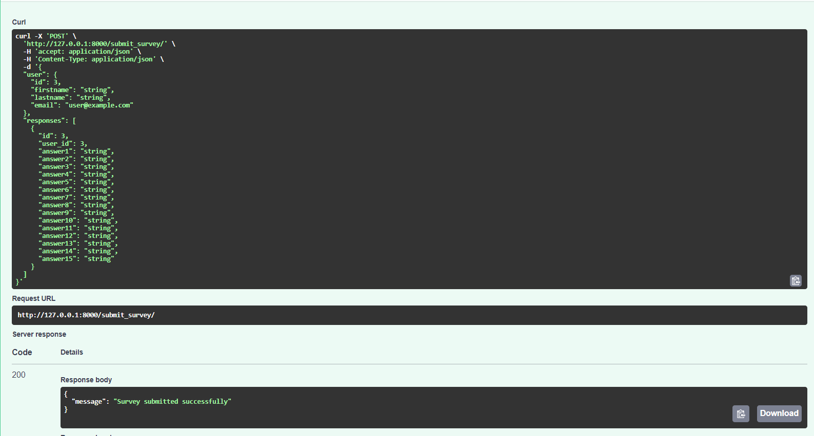
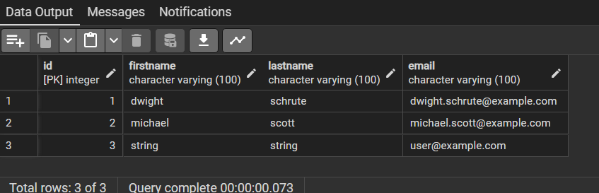
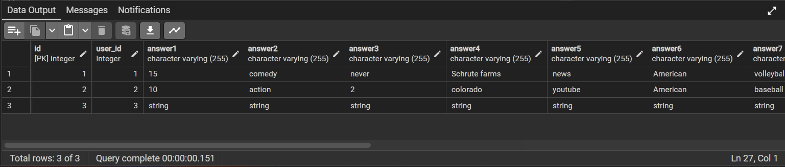

# PostgreSQL-Survey
This is a simple survey tool built with FastAPI and PostgreSQL. The tool allows users to answer a questionnaire consisting of 15 questions and stores the responses in a PostgreSQL database.

